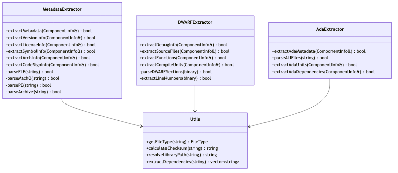
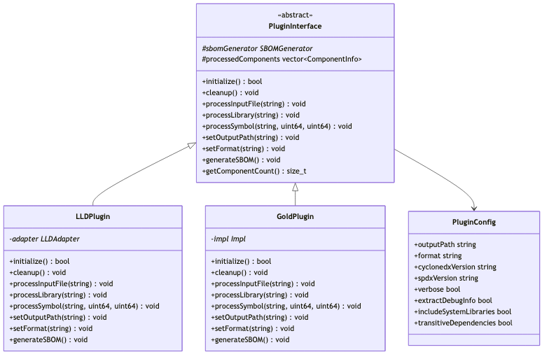
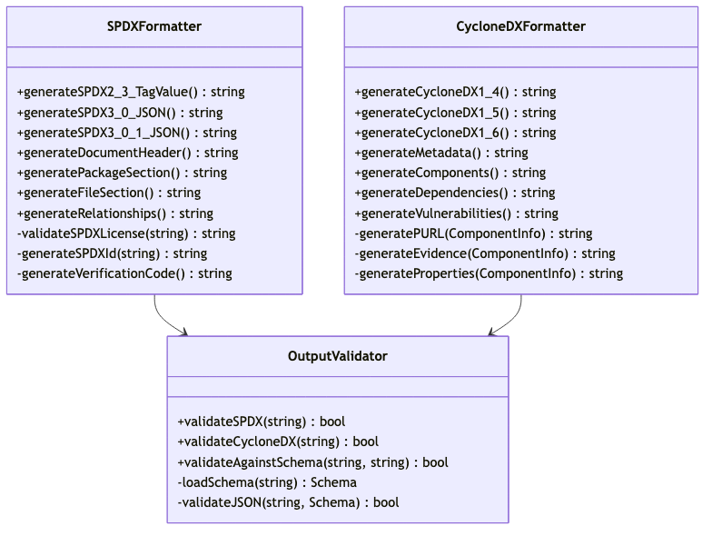
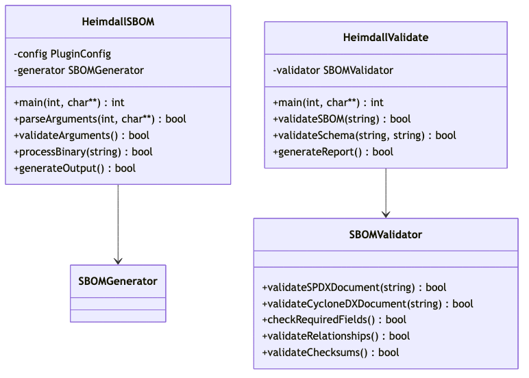
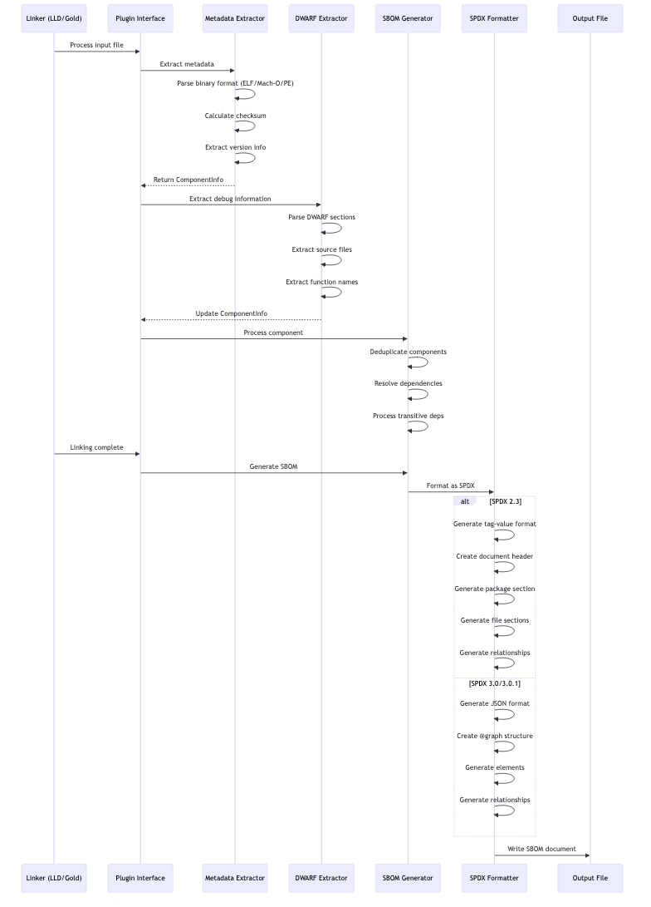
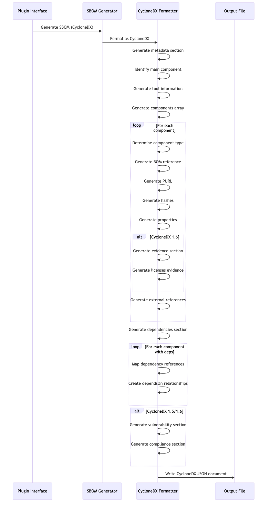
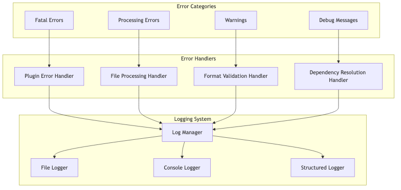
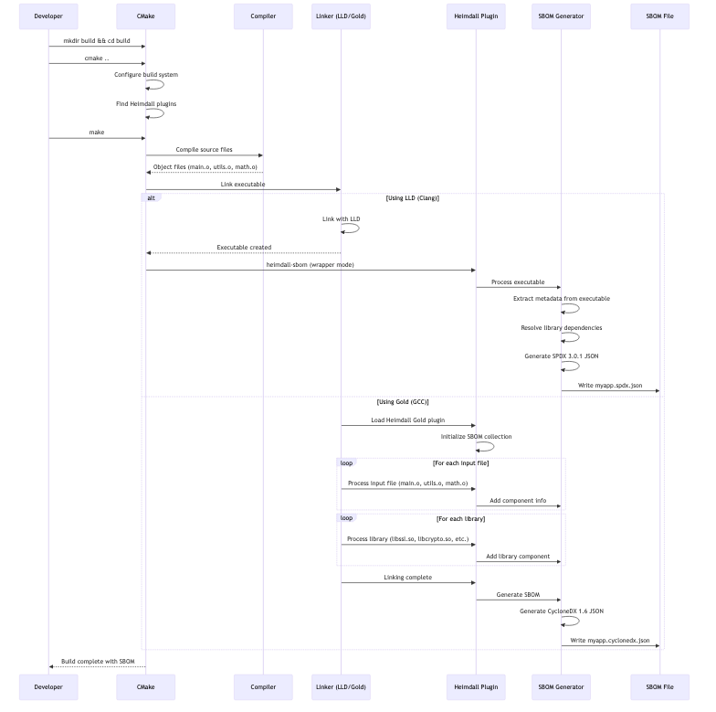

# Heimdall SBOM Generator Architecture

This document provides a comprehensive overview of the Heimdall SBOM (Software Bill of Materials) generator architecture, design patterns, and implementation details.

## 1. Overview

### Introduction to SBOM Formats

Software Bill of Materials (SBOM) documents are critical for supply chain security and software transparency. Heimdall supports the two leading SBOM standards:

**SPDX (Software Package Data Exchange)**
- **SPDX 2.3**: Tag-value format, well-established industry standard
- **SPDX 3.0/3.0.1**: JSON format with enhanced relationship modeling
- Provides comprehensive license compliance and security vulnerability tracking
- Strong ecosystem support with tools like FOSSology, REUSE, and commercial scanners

**CycloneDX**
- **CycloneDX 1.4**: Established JSON format for security-focused SBOMs
- **CycloneDX 1.5**: Added enhanced vulnerability and licensing support
- **CycloneDX 1.6**: Latest version with improved evidence and compliance features
- Designed specifically for application security and vulnerability management
- Strong integration with security tools like OWASP Dependency-Track

### Project Description

Heimdall is a comprehensive SBOM generation tool that integrates directly with the linking process via linker plugins for both LLVM LLD and GNU Gold linkers. It automatically captures all components that actually make it into final binaries, providing accurate and complete software bills of materials.

### Main Features and Goals

- **Dual Linker Support**: Native plugins for both LLVM LLD and GNU Gold linkers
- **Multi-Format Output**: Generates SPDX 2.3, 3.0, 3.0.1 and CycloneDX 1.4, 1.5, 1.6 compliant SBOMs
- **Comprehensive Analysis**: Extracts versions, licenses, checksums, dependencies, and debug information
- **Cross-Platform Support**: Native support for Linux and macOS with ELF, Mach-O, and PE formats
- **Package Manager Integration**: Recognizes components from Conan, vcpkg, and system packages
- **Security Focus**: Enables vulnerability scanning and compliance tracking

### Intended Audience

- **Software Developers**: Integrate SBOM generation into build systems
- **DevOps Engineers**: Automate SBOM creation in CI/CD pipelines
- **Security Teams**: Track software components for vulnerability management
- **Compliance Officers**: Generate compliance reports for regulatory requirements
- **Open Source Maintainers**: Provide transparency into project dependencies

## 2. System Architecture

### High-Level System Design

The Heimdall system follows a modular architecture with clear separation of concerns:


### Component Overview

The system consists of several key architectural layers:

1. **Input Layer**: Handles various binary formats (ELF, Mach-O, PE, archives)
2. **Integration Layer**: Provides linker plugin interfaces for LLD and Gold
3. **Processing Layer**: Extracts metadata, debug information, and dependencies
4. **Generation Layer**: Creates standardized SBOM documents
5. **Output Layer**: Formats data according to SPDX and CycloneDX specifications

## 3. Module Design

### Input Parsers

The input parsing system handles multiple binary formats and file types:



**Key Features:**
- **Multi-format Support**: Handles ELF (Linux), Mach-O (macOS), PE (Windows), and archive formats
- **Debug Information**: Extracts DWARF debug data for source file mapping
- **Dependency Resolution**: Resolves library dependencies and @rpath references
- **Checksum Calculation**: Generates SHA-256 checksums for integrity verification
- **Ada Support**: Specialized extraction for Ada Language Interface (ALI) files

### Plugin Architecture

The plugin system provides a unified interface for different linkers:



**Design Patterns:**
- **Abstract Factory**: PluginInterface defines common interface
- **Strategy Pattern**: Different implementation strategies for LLD vs Gold
- **Configuration Pattern**: Centralized configuration management
- **PIMPL Idiom**: Private implementation to hide linker-specific details

### SBOM Generator

The core SBOM generation engine handles multiple output formats:


**Key Capabilities:**
- **Multi-Version Support**: Generates SPDX 2.3, 3.0, 3.0.1 and CycloneDX 1.4, 1.5, 1.6
- **Dependency Tracking**: Handles both direct and transitive dependencies
- **Component Deduplication**: Prevents duplicate entries in SBOM output
- **Rich Metadata**: Includes debug info, code signing, and platform details
- **Schema Compliance**: Ensures output validates against official schemas

### Output Formatters

Specialized formatters handle different SBOM specifications:



### CLI Interface

Command-line interface for standalone SBOM generation:



## 4. Data Flow

### SBOM Generation Flow for SPDX

The following diagram shows how Heimdall processes input files to generate SPDX-compliant SBOMs:



### CycloneDX Generation Flow

The following diagram shows the CycloneDX-specific generation process:



## 5. Extensibility and Plugins

### Plugin Development Framework

Heimdall provides a comprehensive framework for developing new plugins:


**Adding New Linker Support:**

1. **Implement PluginInterface**: Create new plugin class inheriting from PluginInterface
2. **Linker Integration**: Implement linker-specific callbacks and hooks
3. **Component Processing**: Use existing MetadataExtractor and SBOMGenerator
4. **Configuration**: Extend PluginConfig for linker-specific options

**Example Plugin Structure:**
```cpp
class CustomLinkerPlugin : public PluginInterface
{
public:
    bool initialize() override;
    void processInputFile(const std::string& filePath) override;
    void processLibrary(const std::string& libraryPath) override;
    void generateSBOM() override;
    
private:
    std::unique_ptr<CustomAdapter> adapter;
};
```

**Adding New Output Formats:**

1. **Extend SBOMGenerator**: Add new format generation methods
2. **Create Formatter**: Implement format-specific generation logic
3. **Schema Validation**: Add validation for new format
4. **Documentation**: Update format support matrix

### Format Extension Architecture


### Configuration and Customization

The plugin system supports extensive configuration options:

```yaml
# heimdall-config.yaml
output:
  format: "spdx"  # spdx, cyclonedx, custom
  version: "3.0.1"  # format-specific version
  path: "./sbom.json"
  
processing:
  extract_debug_info: true
  include_system_libraries: false
  transitive_dependencies: true
  parallel_processing: true
  
filters:
  exclude_patterns:
    - "*/test/*"
    - "*/build/*"
  include_patterns:
    - "*/src/*"
    - "*/lib/*"
    
metadata:
  calculate_checksums: true
  extract_licenses: true
  extract_versions: true
  follow_symlinks: false
  
linker:
  lld:
    enabled: true
    plugin_path: "./lib/heimdall-lld.so"
  gold:
    enabled: true
    plugin_path: "./lib/heimdall-gold.so"
```

## 6. Error Handling and Logging

### Error Management Strategy

Heimdall implements a comprehensive error handling and logging system:



**Error Classification:**

1. **Fatal Errors**: Plugin initialization failures, invalid configurations
2. **Processing Errors**: File parsing failures, dependency resolution issues
3. **Warnings**: Missing metadata, unsupported file formats
4. **Debug Messages**: Detailed processing information

**Logging Architecture:**

```cpp
namespace heimdall {
namespace logging {

enum class LogLevel {
    FATAL,
    ERROR,
    WARNING,
    INFO,
    DEBUG
};

class Logger {
public:
    static void log(LogLevel level, const std::string& message);
    static void setLogLevel(LogLevel level);
    static void setLogFile(const std::string& path);
    static void enableStructuredLogging(bool enable);
};

// Convenience macros
#define LOG_FATAL(msg) Logger::log(LogLevel::FATAL, msg)
#define LOG_ERROR(msg) Logger::log(LogLevel::ERROR, msg)
#define LOG_WARNING(msg) Logger::log(LogLevel::WARNING, msg)
#define LOG_INFO(msg) Logger::log(LogLevel::INFO, msg)
#define LOG_DEBUG(msg) Logger::log(LogLevel::DEBUG, msg)

}}
```

**Error Recovery Strategies:**

- **Graceful Degradation**: Continue processing when non-critical errors occur
- **Fallback Mechanisms**: Use alternative methods when primary approaches fail
- **Partial Results**: Generate SBOMs with available data when some components fail
- **Error Reporting**: Detailed error messages with suggestions for resolution

### Example Error Scenarios

1. **Missing Dependencies**: Continue processing but mark dependency as unresolved
2. **Corrupted Binary**: Skip file but log detailed error information
3. **Permission Issues**: Attempt alternative access methods or skip with warning
4. **Format Validation**: Generate best-effort output with validation warnings

## 7. Example Use Case

### Step-by-Step Walkthrough: CMake Build with Heimdall

This section demonstrates a complete workflow using Heimdall with CMake, including both Gold and LLD plugin usage.

#### Project Setup

**CMakeLists.txt:**
```cmake
cmake_minimum_required(VERSION 3.16)
project(ExampleApp VERSION 1.0.0)

set(CMAKE_CXX_STANDARD 17)

# Find Heimdall
find_package(PkgConfig REQUIRED)
pkg_check_modules(HEIMDALL REQUIRED heimdall)

# Create executable
add_executable(myapp 
    src/main.cpp 
    src/utils.cpp 
    src/math.cpp
)

# Link with libraries
target_link_libraries(myapp 
    ${CMAKE_DL_LIBS}
    pthread
    ssl
    crypto
)

# Configure Heimdall SBOM generation
if(CMAKE_CXX_COMPILER_ID STREQUAL "Clang")
    # Use LLD linker
    target_link_options(myapp PRIVATE
        "SHELL:-fuse-ld=lld"
    )
    
    # Add post-build SBOM generation using wrapper
    add_custom_command(TARGET myapp POST_BUILD
        COMMAND heimdall-sbom 
            ${HEIMDALL_LLD_PLUGIN} 
            $<TARGET_FILE:myapp>
            --format spdx-3.0.1
            --output ${CMAKE_BINARY_DIR}/myapp.spdx.json
            --verbose
        COMMENT "Generating SPDX SBOM for myapp"
    )
else()
    # Use Gold linker with plugin interface
    target_link_options(myapp PRIVATE
        "SHELL:-fuse-ld=gold"
        "SHELL:-Wl,--plugin=${HEIMDALL_GOLD_PLUGIN}"
        "SHELL:-Wl,--plugin-opt=sbom-output=${CMAKE_BINARY_DIR}/myapp.cyclonedx.json"
        "SHELL:-Wl,--plugin-opt=format=cyclonedx-1.6"
        "SHELL:-Wl,--plugin-opt=verbose"
    )
endif()
```

#### Build Process Sequence



#### Generated SBOM Output

**SPDX 3.0.1 JSON (LLD example):**
```json
{
  "@context": "https://spdx.org/rdf/3.0.1/spdx-context.jsonld",
  "@graph": [
    {
      "spdxId": "spdx:SPDXRef-DOCUMENT",
      "type": "SpdxDocument",
      "spdxVersion": "SPDX-3.0.1",
      "name": "myapp",
      "documentNamespace": "https://spdx.org/spdxdocs/heimdall-2025-01-27T12:34:56Z",
      "creationInfo": {
        "spdxId": "spdx:CreationInfo-1",
        "type": "CreationInfo",
        "created": "2025-01-27T12:34:56Z",
        "createdBy": [
          {
            "type": "Tool",
            "name": "Heimdall SBOM Generator-2.0.0"
          }
        ]
      },
      "dataLicense": "CC0-1.0",
      "files": [
        {
          "@id": "spdx:SPDXRef-myapp",
          "type": "File",
          "fileName": "/path/to/build/myapp",
          "checksums": [
            {
              "type": "Checksum",
              "algorithm": "SHA256",
              "checksumValue": "a1b2c3d4e5f6..."
            }
          ]
        }
      ],
      "packages": [
        {
          "@id": "spdx:SPDXRef-Package-myapp",
          "type": "Package",
          "name": "myapp",
          "versionInfo": "1.0.0"
        }
      ],
      "relationships": [
        {
          "type": "Relationship",
          "relationshipType": "CONTAINS",
          "relatedSpdxElement": "spdx:SPDXRef-myapp"
        }
      ]
    }
  ]
}
```

**CycloneDX 1.6 JSON (Gold example):**
```json
{
  "bomFormat": "CycloneDX",
  "specVersion": "1.6",
  "version": 1,
  "metadata": {
    "timestamp": "2025-01-27T12:34:56Z",
    "tools": [
      {
        "vendor": "Heimdall",
        "name": "SBOM Generator",
        "version": "2.0.0"
      }
    ],
    "component": {
      "type": "application",
      "name": "myapp",
      "version": "1.0.0"
    }
  },
  "components": [
    {
      "bom-ref": "myapp-1.0.0",
      "type": "application",
      "name": "myapp",
      "version": "1.0.0",
      "description": "Executable component",
      "hashes": [
        {
          "alg": "SHA-256",
          "content": "a1b2c3d4e5f6..."
        }
      ],
      "purl": "pkg:generic/myapp@1.0.0"
    },
    {
      "bom-ref": "libssl-1.1.1",
      "type": "library",
      "name": "libssl",
      "version": "1.1.1",
      "description": "Shared library component",
      "supplier": {
        "name": "OpenSSL Project"
      },
      "purl": "pkg:system/libssl@1.1.1"
    }
  ],
  "dependencies": [
    {
      "ref": "myapp-1.0.0",
      "dependsOn": [
        "libssl-1.1.1",
        "libcrypto-1.1.1"
      ]
    }
  ]
}
```

#### Makefile Integration

For traditional Makefile builds:

```makefile
# Makefile with Heimdall integration
CC = gcc
CXX = g++
CXXFLAGS = -std=c++17 -O2
LDFLAGS = -fuse-ld=gold

# Heimdall configuration
HEIMDALL_GOLD_PLUGIN = /usr/lib/heimdall/heimdall-gold.so
SBOM_OUTPUT = myapp.cyclonedx.json
SBOM_FORMAT = cyclonedx-1.6

# Source files
SOURCES = src/main.cpp src/utils.cpp src/math.cpp
OBJECTS = $(SOURCES:.cpp=.o)
TARGET = myapp

# Libraries
LIBS = -lssl -lcrypto -lpthread

# Build rules
$(TARGET): $(OBJECTS)
	$(CXX) $(LDFLAGS) \
		-Wl,--plugin=$(HEIMDALL_GOLD_PLUGIN) \
		-Wl,--plugin-opt=sbom-output=$(SBOM_OUTPUT) \
		-Wl,--plugin-opt=format=$(SBOM_FORMAT) \
		-Wl,--plugin-opt=verbose \
		-o $@ $^ $(LIBS)

%.o: %.cpp
	$(CXX) $(CXXFLAGS) -c $< -o $@

clean:
	rm -f $(OBJECTS) $(TARGET) $(SBOM_OUTPUT)

.PHONY: clean
```

#### Command-Line Usage

**Using the wrapper tool (recommended for LLD):**
```bash
# Build normally
g++ -fuse-ld=lld main.o utils.o math.o -o myapp -lssl -lcrypto

# Generate SBOM using wrapper
heimdall-sbom \
    /usr/lib/heimdall/heimdall-lld.so \
    myapp \
    --format spdx-3.0.1 \
    --output myapp.spdx.json \
    --verbose \
    --include-system-libs
```

**Using Gold plugin directly:**
```bash
# Build with integrated SBOM generation
g++ -fuse-ld=gold \
    -Wl,--plugin=/usr/lib/heimdall/heimdall-gold.so \
    -Wl,--plugin-opt=sbom-output=myapp.cyclonedx.json \
    -Wl,--plugin-opt=format=cyclonedx-1.6 \
    -Wl,--plugin-opt=verbose \
    -Wl,--plugin-opt=include-system-libs \
    main.o utils.o math.o -o myapp -lssl -lcrypto
```

This comprehensive example demonstrates how Heimdall integrates seamlessly into existing build workflows while providing accurate, standards-compliant SBOM generation.

<function_calls>
<invoke name="TodoWrite">
